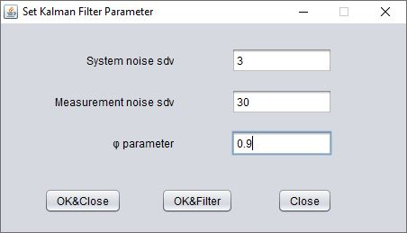
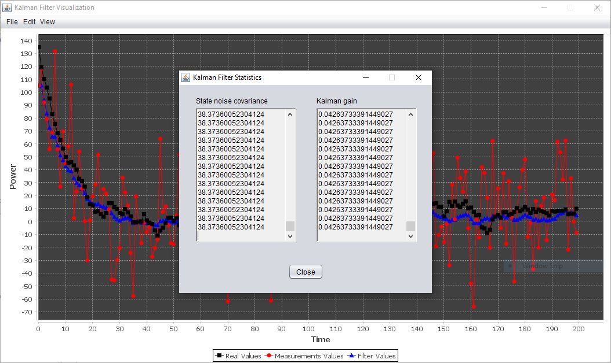

# Kalman Filter

## Contents
* [Introduction](#anchor1)
* [Application's functionalities](#anchor2)
* [About algorithm](#anchor3)
* [Usage instructions along with screenshots](#anchor4)

##  Introduction
It's about a Java Desktop application that implements the Kalman filter technique for the procession of sequential data of a specific sensor. This technique is appropriate for filtering noise from the measurements of a sensor by producing estimations close to the sensor's actual state values.

The application was built by using Java8 (jdk-8u221-x64) in NetBeans IDE (version 8.2). Also, the JFree library (version 1.0.19) was included in the project for the required chart's generation. The project was assigned in the context of "Software and  Networking Technologies" course during my undergradute studies.

##  Application's functionalities
Specifically, the application does the following:
1. Reads the sensor's measurements and the corresponding actual state values from a text (.txt) file which the user selects and uploads. Note that the actual state values are also loaded for testing purposes.
2. Filters the noise from measurements and produces estimations, known as "Kalman filter" estimations.
3. Illustrates graphically on a chart the results of the estimates along with the sensor's measurements and actual state values, all as a function of time.
4. Calculates the deviation between noise and measurements, as well as the deviation between Kalman's filter estimations and measurements.
5. Calculates the state noise covariance and the gain of Kalman filter.

##  About algorithm
Τhis Kalman filter's algorithm is based on a sensor that measures the radiation power P a radioactive particle emits and is reduced as a function of time t given by the equation P(t+1) = φ P(t), 0<φ<1. The sequential real state values are given by this equation and affected by noise which follows the normal distribution with mean value 0 and standard deviation σ1 (system noise standard deviation). On the other side, according to the sensor's manufacturer, the measurements deviate from the real values due to noise that follows a normal distribution with mean value 0 and standard deviation σ2 (measurement noise standard deviation).

##  Usage instructions along with screenshots

1. First, run the app and following windows will appear.

2. Go to "File" menu and select "Load Measurements From File" or key in "Ctrl+O".

3. Select and open a text (.txt) file which contains the real state values (in the 1st column) and sensor's measurements (in the 2nd column). Note the values in each line must be separated by a backspace. Such a text file that contains measurements is already contained in our project's folder for testing purposes and is named "measurements.txt".

4. Type in the required parameters in the form that will appear and click on "OK&Filter". (In case this choice does not appear, this means that the uploaded file does not follow the format described before.). Remember that φ parameter must be a number between 0 and 1 (exclusive), while the two standard deviation values must be positive numbers.

5. Once you set the parameters and clicked on "OK&Filter", the chart will appear. Note that the red line depicts the measurements, the black line depicts the real values, while the blue one depicts the estimates that the Kalman's filter generates.

6. If you go to "View" menu and select "Show Deviation Values" or type in "Ctrl+D" then you can see in a new window the calculated deviation between noise and real measurements, as well as the deviation between the Kalman filter estimates and the real measurements.

7. If you go to "View" menu and select "Show Statistics" or type in "Shift+S" then you can see in a new window the calculated state noise covariance and the Kalman gain as the time passes.

8. Finally, if you want to change the Kalman filter parameters you can do that by going to the "Edit" menu or typing in "Ctrl+S". Then, after you have filled in the new parameters and click on "OK&Filter" to see the new chart.

